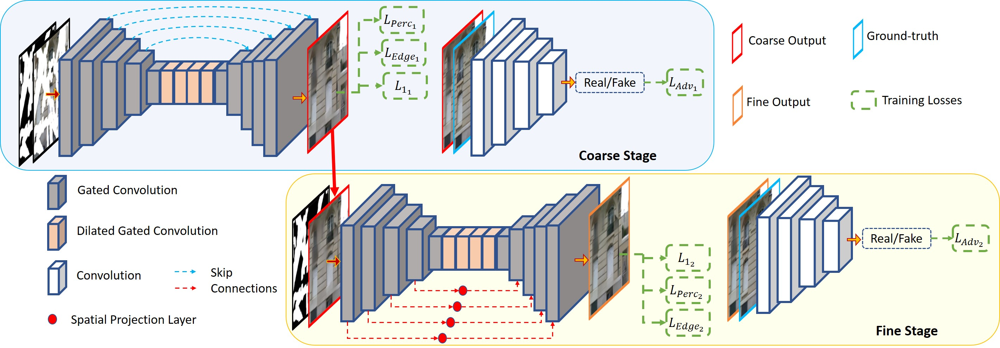

# Image Inpainting via Spatial Projections in PyTorch [PR-22]

PyTorch implementation of [Image Inpainting via Spatial Projections](https://www.sciencedirect.com/science/article/pii/S0031320322005209#:~:text=A%20novel%20architecture%20is%20proposed,without%20any%20self%2Dattention%20mechanism.&text=A%20spatial%20projection%20layer%20is,consistency%20in%20the%20inpainted%20image.).

## Prerequisites

- Python 3.6+
- [PyTorch>1.0](https://pytorch.org/get-started/previous-versions/)
- cv2, numpy, PIL, torchvision

## Usage

Keep your dataset by placing images like:

    dataset
    ├── celeb
    │   ├── input
    │   │   ├── 1.png 
    │   │   ├── 2.png 
    │   │   └── ...
    │   └── mask
    │       ├── 1.png
    │       └── ...
    ├── places2
    │   ├── input
    │   │   ├── 1.png 
    │   │   ├── 2.png 
    │   │   └── ...
    │   └── mask
    │       ├── 1.png 
    │       └── ...
    └── paris
        ├── input
        │   ├── 1.png 
        │   ├── 2.png 
        │   └── ...
        └── mask
            ├── 1.png 
            └── ...

## Checkpoints:
    The checkpoints are provided for:
    1. CelebA-HQ dataset.
    2. Places2 dataset.
    3. Paris Street View dataset.
    3. Keep the checkpoints in "./checkpoints/dataset/"

Download the checkpoint: 

To test the network:

    python test.py --dataset_name celeb 

The results will be stored in:

    ./output_celeb

## Citation
If our method is useful for your research, please consider citing:

    @article{phutke2023image,
    title={Image inpainting via spatial projections},
    author={Phutke, Shruti S and Murala, Subrahmanyam},
    journal={Pattern Recognition},
    volume={133},
    pages={109040},
    year={2023},
    publisher={Elsevier}
    }

